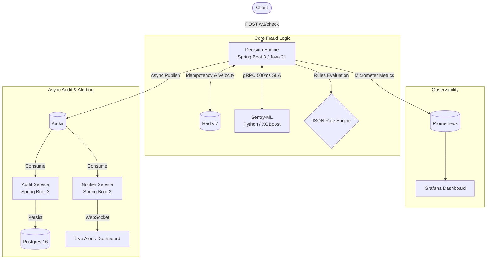

# Sentinel-Auth: Real-Time Fraud Detection Engine

> **Adaptive fraud detection engine scoring transactions using behavioral baselines, XGBoost ML inference, velocity checks, and circuit breakers — processing 530+ RPS at p99 185ms.**

**Author**: Raghav Rajoria

## 📌 System Architecture




## 🚀 Key Features & Impact

* **High-Throughput Microservices**: Architected a microservices fraud detection system processing **530+ RPS at p99 185ms** using Java 21 Virtual Threads and async Kafka publishing.
* **Production-Grade ML**: Trained an XGBoost model on 590k IEEE-CIS transactions achieving **AUC 0.903**, served via a Python gRPC service with a strict 500ms SLA and Resilience4j circuit breaker to prevent cascade failures.
* **Advanced Threat Mitigation**: Implemented an idempotent decision API with Redis SETNX, velocity checks via sliding window counters, and a JSON rule engine—eliminating duplicate charges and detecting transaction bursts.
* **Transparent Auditing**: Designed a Kafka-based audit pipeline with a `/v1/explanation` API returning full decision traces (including ML features, model version, and rules fired), enabling strict regulatory compliance.

## 🛠️ Tech Stack

* **Core Application**: Java 21, Spring Boot 3.5.14, Maven
* **Machine Learning**: Python 3.10.11, XGBoost, scikit-learn, gRPC
* **Data & Messaging**: Redis 7, Postgres 16, Kafka (Confluent 7.6.0)
* **Resilience & Testing**: Resilience4j 2.2.0, k6
* **Observability**: Prometheus, Grafana, Micrometer
* **Infrastructure**: Docker Desktop

## 📊 Performance & Observability


## 🚨 Real-Time Alerting


## 🧠 Transaction Evaluation Flow

1. **Idempotency**: Redis `SETNX` prevents duplicate processing of the same transaction ID within 24 hours.
2. **Context Gathering**: Fetch user history (last 50 transactions, 7-day TTL) from Redis.
3. **Velocity Checks**: Sliding window checks in Redis detect rapid, sequential transaction bursts.
4. **ML Inference**: A gRPC call to the Python XGBoost service evaluates 29 features. Protected by a Resilience4j Circuit Breaker (500ms deadline).
5. **Rule Engine**: Evaluates JSON-defined rules (e.g., High Amount, Suspicious Round Amount).
6. **Scoring**: Combines ML risk score + rule risk + velocity risk to generate a final `ALLOW`, `REVIEW`, or `BLOCK` decision.
7. **Async Audit**: Publishes the decision to Kafka `transactions.decisions` without blocking the HTTP response.

## 💻 Local Setup & Execution

### Prerequisites

* Docker Desktop running
* Java 21 (Temurin hotspot) set to `JAVA_HOME`
* Python 3.10.11

### 1. Start Infrastructure

```powershell
cd D:\projects\sentinel-auth
docker-compose up -d

```

### 2. Start Sentry-ML (gRPC Service)

```powershell
cd D:\projects\sentinel-auth\sentry-ml
.\venv\Scripts\activate
cd app
python server.py

```

### 3. Start Decision Engine (Core)

```powershell
$env:JAVA_HOME = "C:\Program Files\Eclipse Adoptium\jdk-21.0.11.10-hotspot"
$env:PATH = "$env:JAVA_HOME\bin;" + $env:PATH
cd D:\projects\sentinel-auth\decision-engine
mvn spring-boot:run -s .mvn/settings.xml -Duser.timezone=UTC

```

### 4. Start Audit & Notifier Services

Run these in separate terminal windows with the same `JAVA_HOME` configuration:

```powershell
# Audit Service
cd D:\projects\sentinel-auth\audit-service
mvn spring-boot:run -s .mvn/settings.xml -Duser.timezone=UTC

# Notifier Service
cd D:\projects\sentinel-auth\notifier
mvn spring-boot:run -s .mvn/settings.xml

```

## 🧪 API Usage & Testing

**Simulate a Legitimate Transaction (ALLOW)**

```powershell
Invoke-WebRequest -Uri "http://localhost:8080/v1/check" `
  -Method POST `
  -Headers @{"Content-Type"="application/json"} `
  -Body '{"transaction_id":"tx_001","user_id":"user_123","amount":250}' `
  -UseBasicParsing

```

**Simulate a Fraudulent Transaction (BLOCK)**

```powershell
Invoke-WebRequest -Uri "http://localhost:8080/v1/check" `
  -Method POST `
  -Headers @{"Content-Type"="application/json"} `
  -Body '{"transaction_id":"tx_002","user_id":"user_123","amount":9999}' `
  -UseBasicParsing

```

**Fetch Decision Explanation**

```powershell
Invoke-WebRequest -Uri "http://localhost:8081/v1/explanation/tx_002" -UseBasicParsing

```


## 💡 Engineering Challenges Overcome

* **gRPC Cold-Start Latency**: Initial gRPC calls spiked to 1700ms due to connection overhead and XGBoost lazy-loading. Solved by implementing a dummy warmup call during the Python `server.py` startup routine, dropping initial latency to normal bounds.
* **Resilience4j Circuit Breaker Misconfiguration**: Discovered a silent failure where the CB wasn't triggering due to properties placed under the wrong application.yml tree. Fixed hierarchy and validated state transitions (CLOSED → OPEN → HALF_OPEN) during load tests.
* **Cross-Language Serialization**: Debugged silent failures between Java (camelCase) and Python (snake_case) over gRPC. Standardized protobuf field names to ensure accurate feature mapping and score reporting.
* **Timezone & Encoding Discrepancies**: Handled Postgres JDBC rejection of Windows default `Asia/Calcutta` timezones by standardizing the JVM to UTC (`-Duser.timezone=UTC`), and resolved BOM (Byte Order Mark) file encoding issues across PowerShell, Postgres init scripts, and Python.
