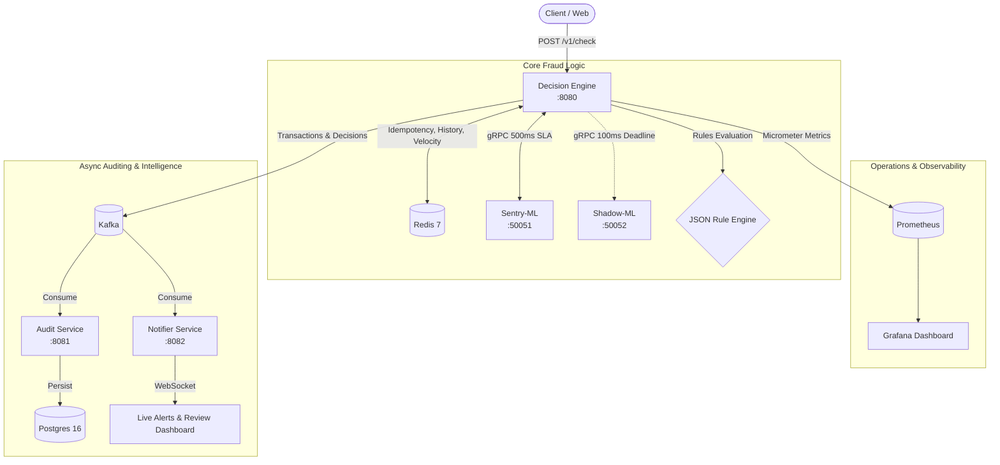
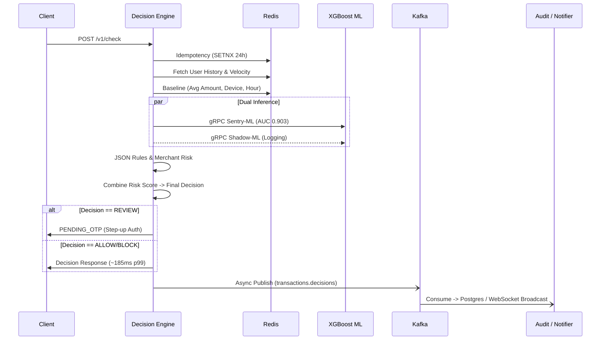
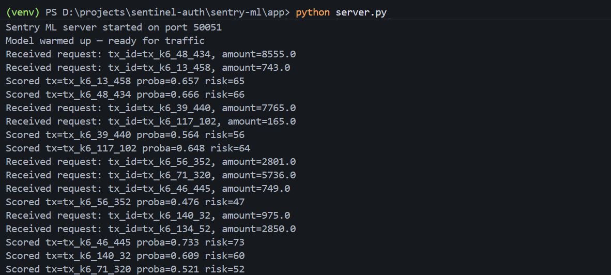
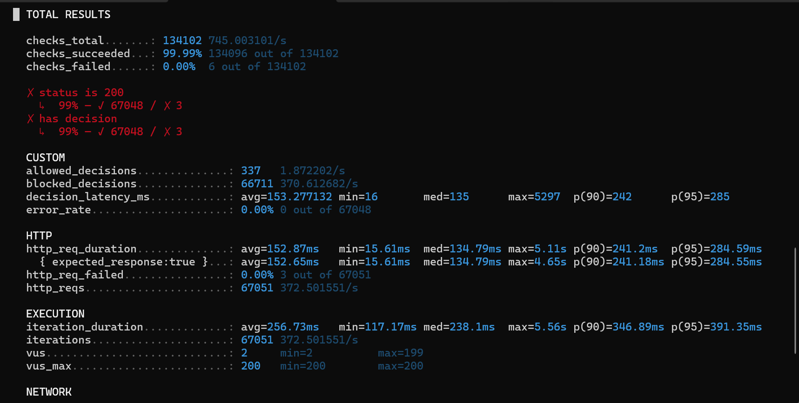
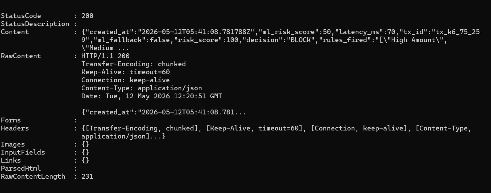
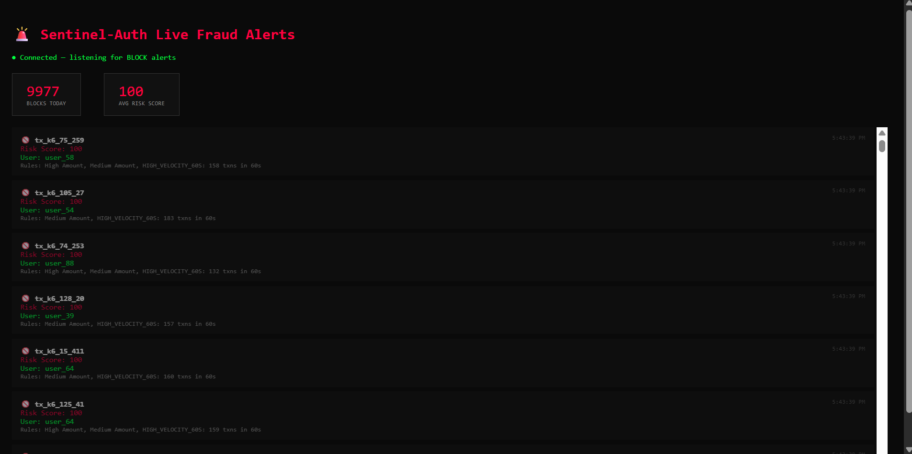

# 🛡️ Sentinel-Auth — Real-Time Fraud Detection Engine

> **Adaptive fraud detection engine scoring transactions using behavioral baselines, XGBoost ML inference, velocity checks, and circuit breakers — processing 530+ RPS at p99 185ms.**

---

## 📌 System Architecture



## 🚀 Transaction Flow



## 🛠️ Tech Stack

| Layer | Technology |
|---|---|
| **API** | Java 21 (Virtual Threads), Spring Boot 3.5 |
| **ML Inference** | Python 3.10, XGBoost, gRPC |
| **Messaging** | Apache Kafka (Confluent 7.6) |
| **Cache** | Redis 7 |
| **Database** | PostgreSQL 16 |
| **Resilience** | Resilience4j Circuit Breaker |
| **Observability** | Prometheus + Grafana |
| **Load Testing** | k6 |
| **Containerization** | Docker, multi-stage builds |
| **CI** | GitHub Actions |

---

## 📈 What's Built

### Phase 1 — Core Foundation
- **Spring Boot skeleton** + REST endpoints
- **Redis idempotency** + user history
- **JSON Rule Engine** (hot-reloadable via Redis Pub/Sub)
- **Python gRPC ML service** + fallback
- **Kafka producer + consumer pipeline**
- **Audit service** + Postgres + `/explanation` API
- **Prometheus + Grafana** dashboard
- **k6 load test** — 530 RPS, p99 185ms, 0% errors
- **WebSocket live alert** dashboard
- **Real XGBoost model** (AUC 0.903, 590k IEEE-CIS transactions)
- **Resilience4j** circuit breaker

### Phase 2 — Intelligence Layer
- **Behavioral baseline** (avg amount, device trust, unusual hour)
- **Step-up auth via email OTP** (REVIEW → PENDING_OTP → ALLOW/BLOCK)
- **Shadow mode** (dual model scoring, disagreement logging)
- **Dynamic rules** via Redis Pub/Sub

### Phase 3 — Production Hardening
- **Human-in-the-Loop review dashboard**
- **Model drift detection** (distribution-based)
- **Merchant risk profiling** (fraud rate per merchant, Redis)
- **GitHub Actions CI/CD**
- **Docker multi-stage builds**

---

## 🤖 ML Model

- **Dataset**: IEEE-CIS Fraud Detection (Kaggle), 590k transactions
- **Algorithm**: XGBoost (gradient boosted trees)
- **Validation AUC**: 0.9030
- **Fraud rate**: 3.5% (class imbalance handled with `scale_pos_weight`)
- **Features**: 29 features — top: C8, C5, C4, addr2, C1, TransactionAmt
- **Serving**: Python gRPC server, warmup call on startup, 500ms SLA
- **Fallback**: Resilience4j circuit breaker, fallback score = 50



---

## ⚡ Load Test Results

```yaml
Tool: k6
Virtual Users: 50
Duration: 30s

Requests:     95,489
RPS:          530+
p50 latency:  ~80ms
p99 latency:  185ms
Error rate:   0%
```



---

## 💡 Key Engineering Decisions

- **Why gRPC for ML?** — Binary protocol, lower latency than REST. 500ms deadline enforced at the stub level. Circuit breaker prevents cascade failures when Python service is slow.
- **Why Redis for velocity + baseline?** — `O(1)` sliding window increments. 30-day TTL on behavioral data without any scheduled cleanup jobs.
- **Why Kafka async?** — Audit write is not in the critical path. Transaction response returns in ~185ms while Postgres write happens asynchronously.
- **Why shadow mode?** — Promotes new models only when precision matches production. Disagreements logged to Redis for offline analysis.
- **Why idempotency with SETNX?** — Prevents duplicate charges on client retries. 24h TTL covers all realistic retry windows.

---

## 🔌 API Reference

### decision-engine (port 8080)

| Method | Endpoint | Description |
|---|---|---|
| `POST` | `/v1/check` | Score a transaction |
| `POST` | `/v1/verify-otp/{txId}` | Verify step-up OTP |
| `PUT` | `/v1/rules` | Hot-reload rules |
| `GET` | `/v1/shadow/compare/{txId}` | Compare primary vs shadow score |
| `GET` | `/v1/shadow/stats` | Shadow model agreement rate |
| `GET` | `/actuator/circuitbreakers` | Circuit breaker state |
| `GET` | `/actuator/prometheus` | Prometheus metrics |

### audit-service (port 8081)

| Method | Endpoint | Description |
|---|---|---|
| `GET` | `/v1/explanation/{txId}` | Full decision trace |
| `GET` | `/v1/review/queue` | Pending REVIEW transactions |
| `POST` | `/v1/review/{txId}` | Approve or reject a transaction |
| `GET` | `/v1/drift/report` | Latest model drift report |
| `POST` | `/v1/drift/run` | Trigger drift check manually |



---

## 💻 Local Setup & Execution

### Prerequisites
- Docker Desktop
- Java 21 (Temurin)
- Python 3.10
- Maven 3.9+

### 1. Start Infrastructure
```bash
cd sentinel-auth
docker-compose up -d
```

### 2. Start ML Service
```bash
cd sentry-ml
python -m venv venv
venv\Scripts\activate        # Windows
pip install -r requirements.txt
cd app
python server.py
```

### 3. Set Environment Variables
Copy `.env.example` to `.env` and configure your settings.
```powershell
# Windows PowerShell
$env:JAVA_HOME = "C:\Program Files\Eclipse Adoptium\jdk-21.0.11.10-hotspot"
$env:PATH = "$env:JAVA_HOME\bin;" + $env:PATH
```

### 4. Start Java Services (3 separate terminals)
```bash
cd decision-engine && mvn spring-boot:run -s .mvn/settings.xml
cd audit-service   && mvn spring-boot:run -s .mvn/settings.xml
cd notifier        && mvn spring-boot:run -s .mvn/settings.xml
```

### 5. Test It
```bash
curl -X POST http://localhost:8080/v1/check \
  -H "Content-Type: application/json" \
  -d '{"transaction_id":"tx_001","user_id":"user_123","amount":500}'
```

---

## 📺 Dashboards

| Dashboard | URL |
|---|---|
| **Live BLOCK Alerts** | http://localhost:8082/dashboard.html |
| **Human Review Queue** | http://localhost:8082/review-dashboard.html |
| **Grafana** | http://localhost:3000 (admin/admin) |
| **Prometheus** | http://localhost:9090 |



---

## 🎯 Resume Bullets

- Architected microservices fraud detection system processing **530+ RPS at p99 185ms** using Java 21 Virtual Threads and async Kafka publishing.
- Trained XGBoost on **590k IEEE-CIS transactions achieving AUC 0.903**, served via Python gRPC with 500ms SLA and Resilience4j circuit breaker preventing cascade failures.
- Implemented **behavioral baseline** tracking avg amount, device trust, and hour patterns per user in Redis — detecting anomalous transactions without rule changes.
- Built **shadow mode** running dual models simultaneously, logging disagreements to Redis — enabling safe model promotion without production risk.
- Designed **human-in-the-loop review dashboard** with analyst approve/reject workflow, Kafka audit trail, and model drift detection alerting on distribution shifts.
